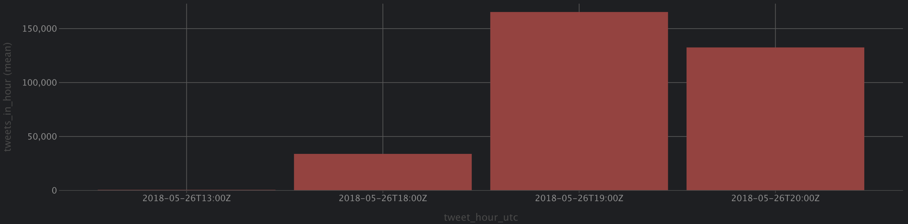
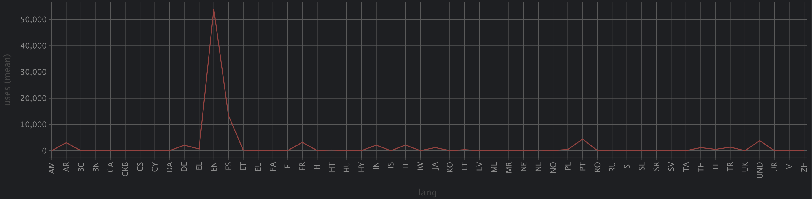
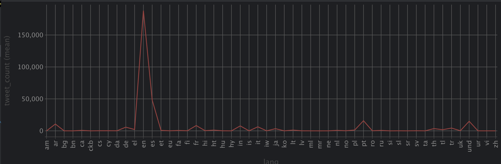

# Assignment 1 – Working with Nested JSON Data

## Dataset

**Name:** TweetsChampions

**Source:** Twitter Streaming API (filtered by `#UCLFinal`)

**Size:** ~1.95 GB

**Records:** ~354,586 tweets

**Capture window:** 2018-05-26, 18:45–20:45 UTC (2018 UEFA Champions League Final, Real Madrid vs Liverpool)

### Why this dataset satisfies requirements

| Requirement    | How it's met                                                                                   |
|----------------|------------------------------------------------------------------------------------------------|
| JSON format    | Yes – newline-delimited JSON                                                                   |
| > 10 MB        | Yes – 1.95 GB                                                                                  |
| Nested objects | `user` (author profile), `entities` (engagement metadata), `geo`, `place`, etc.                |
| Arrays         | `entities.hashtags[]`, `entities.user_mentions[]`, `entities.urls[]`, `entities.media[], etc.` |

### Nested structure overview

```json
{
  "id_str": "1000365563376488448",
  "lang": "en",
  "timestamp_ms": "1527340710859",
  "user": {                         ← nested object
  "id_str": "...",
  "screen_name": "...",
  "followers_count": 15294,
  "verified": false
},
"entities": {
"hashtags": [                       ← array of objects
{"text": "UCLFinal", "indices": [37, 46] }
],
"user_mentions": [...],
"urls": [...]
}
}
```

---

## How to Reproduce

### Prerequisites

- DuckDB (via Python: `pip install duckdb`) or DataGrip with DuckDB JDBC driver
- Dataset file at [kaggle.com](https://www.kaggle.com/datasets/xvivancos/tweets-during-r-madrid-vs-liverpool-ucl-2018)

### Run in order

```bash
01_load.sql    # Load raw JSON into DuckDB
02_parse.sql   # Flatten into structured tables
03_analysis.sql # Window function insights
04_quality.sql  # Data quality checks (optional)
```

---

## Step 1 – Data Loading (`01_load.sql`)

`sample_size = -1` forces DuckDB to scan the full file before inferring types, preventing errors from rare fields (e.g.
`withheld_in_countries`) that only appear in a subset of records.

---

## Step 2 – Parsing & Flattening (`02_parse.sql`)

Two structured tables are created from the raw JSON:

### `tweets` – flattened scalar + user fields

The `user` nested object is **flattened** using DuckDB's dot notation (`"user".field`). Row count stays the same.

### `tweet_hashtags` – unnested hashtags array

`UNNEST` **explodes** the hashtags array – one row per hashtag per tweet. A tweet with 3 hashtags produces 3 rows. Row
count increases.

### Difference between flattening and unnesting

| Operation   | Input                                 | Output                    | Row count |
|-------------|---------------------------------------|---------------------------|-----------|
| **Flatten** | Nested object `user.screen_name`      | Column `user_screen_name` | Same      |
| **Unnest**  | Array `hashtags: ["UCLFinal", "LFC"]` | One row per element       | Increases |

---

## Step 3 – Analysis with Window Functions (`03_analysis.sql`)

### Insight 1 – Top 3 hashtags per language

**Window function:** `RANK() OVER (PARTITION BY lang ORDER BY uses DESC)`
Counts are first aggregated per language, then ranked within each language partition. Ties receive the same rank.

**Result interpretation:** Shows which hashtags dominated each language community during the match. English speakers
used `#UCLFinal` and `#LFC`, Arabic speakers used `#ليفربول_ريال_مدريد`, reflecting how different fan groups engaged
with the same event.



---

### Insight 2 – Running total of tweets per hour (Kyiv time)

**Window function:** `SUM() OVER (ORDER BY tweet_hour_utc ROWS BETWEEN UNBOUNDED PRECEDING AND CURRENT ROW)`
For each hour, sums all tweet counts from the start up to and including the current row – a cumulative total. The `ROWS`
frame is explicit to make the intent clear.

**Result interpretation:** The dataset covers match day (2018-05-26). The stream was captured from 18:45 to 20:45 UTC (
21:45–23:45 Kyiv time). Tweet volume builds through the match, with the largest hourly spike expected during the second
half and full-time whistle.



---

## Step 4 – Data Quality Checks (`04_quality.sql`)

### 1. Null counts – all columns

Checked all columns in both `tweets` and `tweet_hashtags` for missing values.

### 2. Duplicate tweets

Verified that each `tweet_id` appears exactly once.

### 3. Duplicate hashtag pairs

Verified no `(tweet_id, hashtag)` pair appears more than once.

### 4. Negative value validation

Checked that `retweet_count`, `favorite_count`, `reply_count`, `followers_count` are all ≥ 0.

### 5. Date range validation

All tweets should fall on 2018-05-26 (match day). Out-of-range dates are flagged.

### 6. Language distribution



---

## 📚 Theoretical Questions

### 1. Big Data vs Traditional Data Processing

Traditional systems (RDBMS, single-node) are designed for structured data with predictable volume and batch workloads.
Big Data differs in three fundamental ways:

- **Volume** – data exceeds the capacity of a single machine; requires distributed storage (HDFS, S3) and processing (Spark, MapReduce)
- **Velocity** – data arrives continuously (streams); traditional batch ETL cannot keep up; requires stream processing (Kafka, Flink)
- **Distribution** – computation must move to the data, not the other way around; systems must tolerate node failures
  and network partitions

These constraints force a shift from vertical scaling (bigger machine) to horizontal scaling (more machines), changing
assumptions about consistency, latency, and fault tolerance.

---

### 2. The 5Vs of Big Data

| V            | Definition                                | Impact                                                                       |
|--------------|-------------------------------------------|------------------------------------------------------------------------------|
| **Volume**   | Terabytes to petabytes of data            | Requires distributed storage and columnar formats (Parquet)                  |
| **Velocity** | High rate of data arrival                 | Requires streaming ingestion (Kafka) and low-latency processing              |
| **Variety**  | Structured, semi-structured, unstructured | Schema-on-read, flexible formats (JSON, Avro), separate processing pipelines |
| **Veracity** | Uncertainty and noise in data             | Requires data quality checks, deduplication, validation pipelines            |
| **Value**    | Business insights extracted from data     | Drives decisions on what to store, process, and expose                       |

---

### 3. Data Variety and Schema Design

When data comes from many sources with different structures (APIs, logs, IoT sensors), enforcing a fixed schema at write
time (schema-on-write) is impractical – the schema may be unknown or change frequently.

**Schema-on-read** solves this: raw data is stored as-is (JSON, Parquet), and the schema is applied only when querying.
This is exactly what DuckDB does with `read_json_auto` – it infers column types at query time, not at ingest time.

Trade-off: schema-on-read is more flexible but slower at query time, and errors surface later (at read rather than
write).

---

### 4. Data Types Classification

| Type                | Definition                       | Examples                   | Storage & Processing                                         |
|---------------------|----------------------------------|----------------------------|--------------------------------------------------------------|
| **Structured**      | Fixed schema, tabular            | SQL tables, CSV, Excel     | RDBMS (PostgreSQL, MySQL), columnar stores                   |
| **Semi-structured** | Self-describing, flexible schema | JSON, XML, Avro, Parquet   | Document stores (MongoDB), analytical DBs (DuckDB, BigQuery) |
| **Unstructured**    | No schema                        | Text, images, video, audio | Object storage (S3), processed with NLP/CV models            |

---

### 5. Processing Semi-Structured Data

Common techniques:

- **Flattening**: extract nested object fields into columns (`user.screen_name → user_screen_name`)
- **Unnesting**: explode arrays into rows (`UNNEST(hashtags)`)
- **Type casting**: convert JSON strings to proper SQL types (`timestamp_ms::BIGINT`)
- **Path extraction**: navigate nested structures with JSONPath (`json_extract(col, '$.user.name')`)

Analytical databases handle nested data by representing it as native types:

- DuckDB uses `STRUCT` for nested objects and `LIST` for arrays, enabling dot-notation access and `UNNEST`
- BigQuery uses `RECORD` / `REPEATED` fields
- Parquet natively encodes nested structures using Dremel encoding

---

### 6. Massively Parallel Processing (MPP)

MPP systems (Redshift, Snowflake, BigQuery, Greenplum) distribute both **data** and **computation** across multiple
nodes:

1. Data is **sharded** across nodes (by hash or range on a distribution key)
2. Each node processes its local slice in parallel
3. Results are **shuffled and aggregated** across nodes

**Benefits:** linear scalability, fast analytical queries on large datasets, no single bottleneck
**Challenges:** data skew (uneven distribution degrades performance), shuffle cost (network-heavy joins), not suited for
OLTP (row-level updates are expensive)

---

### 7. OLTP vs OLAP Systems

| Dimension                | OLTP                                                    | OLAP                                                |
|--------------------------|---------------------------------------------------------|-----------------------------------------------------|
| **Query patterns**       | Short, frequent, row-level (INSERT/UPDATE/SELECT by PK) | Long, complex, aggregations over large ranges       |
| **Typical technologies** | PostgreSQL, MySQL, Oracle                               | DuckDB, BigQuery, Redshift, Snowflake               |
| **Data storage**         | Row-oriented (fast row lookup)                          | Column-oriented (fast column scans and compression) |
| **Workload**             | Thousands of concurrent transactions                    | Few complex analytical queries                      |
| **Data freshness**       | Real-time                                               | Periodic loads (ETL/ELT)                            |

This assignment uses DuckDB – an embedded OLAP engine. It is optimized for the analytical workloads done here (aggregations, window functions over the full dataset) and would be a poor choice for a transactional system.
